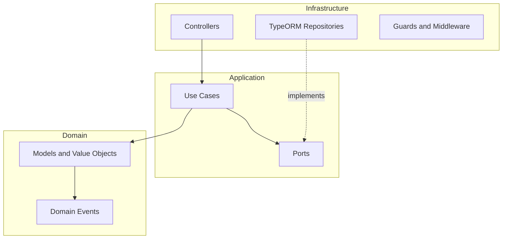

<p align="center">
  <a href="http://nestjs.com/" target="blank"></a>
</p>

<h1 align="center">NestJS + Express API Template</h1>

<p align="center">
  Production-ready REST API template with TypeScript, Clean Architecture, and Hexagonal design
</p>

<p align="center">
  <a href="https://github.com/DonatoCalvillo/api-nestjs-template/actions/workflows/node.yml?branch=main"></a>
  <a href="https://nodejs.org/docs/latest-v22.x/api/index.html"></a>
  <a href="https://www.typescriptlang.org/"></a>
  <a href="https://pnpm.io/"></a>
  <a href="https://jestjs.io/"></a>
  <a href="https://www.docker.com/"></a>
</p>

## What is this?

A starter template for NestJS APIs with dependency injection, strong typing, hexagonal architecture, Docker, migrations, testing, observability, and production patterns (auth, RBAC, audit log, domain events, idempotency, circuit breaker).

Inspired by work from [Fernando Herrera](https://github.com/Klerith) and [Albert Hernandez](https://github.com/AlbertHernandez).

## Tech stack

| Layer | Choice |
|-------|--------|
| Runtime | Node.js 22 |
| Framework | NestJS 11 + Express |
| Language | TypeScript 6 |
| Package manager | pnpm 11 |
| ORM | TypeORM + PostgreSQL |
| Testing | Jest (unit, integration, e2e, contract) |
| Observability | Pino, Prometheus, OpenTelemetry |

## Quick start

```bash
git clone https://github.com/DonatoCalvillo/api-nestjs-template.git
cd api-nestjs-template && pnpm install
cp example.env .env
docker compose up -d db
pnpm migration:run
pnpm seed:rbac
pnpm start:dev
```

API: `http://localhost:3000/api/v1` · Swagger: `http://localhost:3000/api/docs`

### Debug (VS Code)

Create `.vscode/launch.json`:

```json
{
  "version": "0.1.0",
  "configurations": [
    {
      "type": "node",
      "request": "attach",
      "name": "Attach to Rest Api",
      "restart": true,
      "port": 9229
    }
  ]
}
```

Run `pnpm start:debug` or `docker compose up -d rest-api-dev` (debug port `9229`).

## Architecture



Each feature module under `src/modules/{feature}/` has `domain/`, `application/`, and `infrastructure/` layers. Shared cross-cutting code lives in `src/modules/shared/`.

**Reference module:** `src/modules/users/` — see [docs/guides/reference-users-module.md](docs/guides/reference-users-module.md).

## Documentation map

Documentation is split into three tiers:

| Tier | Location | Purpose |
|------|----------|---------|
| **README** (this file) | Root | Onboarding, quick start, navigation |
| **Features** | [docs/features/](docs/features/README.md) | What the template provides (architecture, security, auth, resilience, observability, ops) |
| **Guides** | [docs/guides/](docs/guides/README.md) | How to build (modules, use cases, repos, controllers, Swagger, events, tests) |

### Features (what)

| Topic | Doc |
|-------|-----|
| Hexagonal architecture | [architecture.md](docs/features/architecture.md) |
| CORS, Helmet, IP filter, rate limiting | [security.md](docs/features/security.md) |
| API envelope and errors | [api-contract.md](docs/features/api-contract.md) |
| JWT, RBAC, MFA, OIDC, API keys | [auth.md](docs/features/auth.md) |
| HTTP resilience (retry, circuit breaker) | [http-resilience.md](docs/features/reliability/http-resilience.md) |
| Inbound idempotency | [idempotency.md](docs/features/reliability/idempotency.md) |
| Domain events and outbox | [domain-events-and-outbox.md](docs/features/reliability/domain-events-and-outbox.md) |
| Audit log | [audit-log.md](docs/features/reliability/audit-log.md) |
| Metrics, logging, tracing | [observability/](docs/features/observability/) |
| Database, caching, persistence | [data/](docs/features/data/) |
| Docker, Helm, health, multi-instance | [operations/](docs/features/operations/) |

### Guides (how)

| Topic | Doc |
|-------|-----|
| New feature module (checklist) | [new-feature-module.md](docs/guides/new-feature-module.md) |
| Domain models and value objects | [domain-models.md](docs/guides/domain-models.md) |
| Entities and migrations | [entities-and-migrations.md](docs/guides/entities-and-migrations.md) |
| Repositories and mappers | [repositories-and-mappers.md](docs/guides/repositories-and-mappers.md) |
| Use cases | [use-cases.md](docs/guides/use-cases.md) |
| Controllers (`BaseController`) | [controllers.md](docs/guides/controllers.md) |
| DTOs and validation | [dtos-and-validation.md](docs/guides/dtos-and-validation.md) |
| Swagger / OpenAPI | [swagger-documentation.md](docs/guides/swagger-documentation.md) |
| Domain events and handlers | [domain-events.md](docs/guides/domain-events.md) |
| Domain errors | [domain-errors.md](docs/guides/domain-errors.md) |
| Audit logging (`@AuditLog`) | [audit-logging.md](docs/guides/audit-logging.md) |
| RBAC on endpoints | [rbac-on-endpoints.md](docs/guides/rbac-on-endpoints.md) |
| Testing | [testing.md](docs/guides/testing.md) |

## Scripts

| Command | Description |
|---------|-------------|
| `pnpm start:dev` | Hot reload development |
| `pnpm start:debug` | Development + debug port 9229 |
| `pnpm build` | Compile to `dist/` |
| `pnpm start:prod` | Run production build |
| `pnpm test` | Unit tests |
| `pnpm test:integration` | Integration tests (Testcontainers) |
| `pnpm test:e2e` | End-to-end tests |
| `pnpm test:contract` | OpenAPI snapshot |
| `pnpm test:cov` | Unit coverage (80% gate) |
| `pnpm lint` / `pnpm lint:fix` | ESLint |
| `pnpm migration:generate src/database/migrations/Name` | Generate migration |
| `pnpm migration:run` | Run migrations |
| `pnpm migration:revert` | Revert last migration |
| `pnpm seed:rbac` | Seed roles and permissions |

## Docker

```bash
docker compose up -d db              # PostgreSQL only
docker compose up -d db redis        # + Redis for multi-instance
docker compose up -d rest-api-dev    # Dev with hot reload
docker compose up -d rest-api-prd    # Production build
docker compose --profile multi-instance up -d   # Two replicas
docker compose --profile storage up -d minio      # S3-compatible storage
```

Copy `example.env` to `.env` first. See [docs/features/operations/deployment.md](docs/features/operations/deployment.md).

## Environment

All variables are documented in [`example.env`](example.env) and validated at startup. Feature docs include tables per concern.

## Health checks

| Endpoint | Purpose |
|----------|---------|
| `GET /health/live` | Liveness |
| `GET /health/ready` | Readiness (DB + shutdown state) |
| `GET /health` | Deep check (disk, OTLP) |

Details: [docs/features/operations/health-checks.md](docs/features/operations/health-checks.md).
