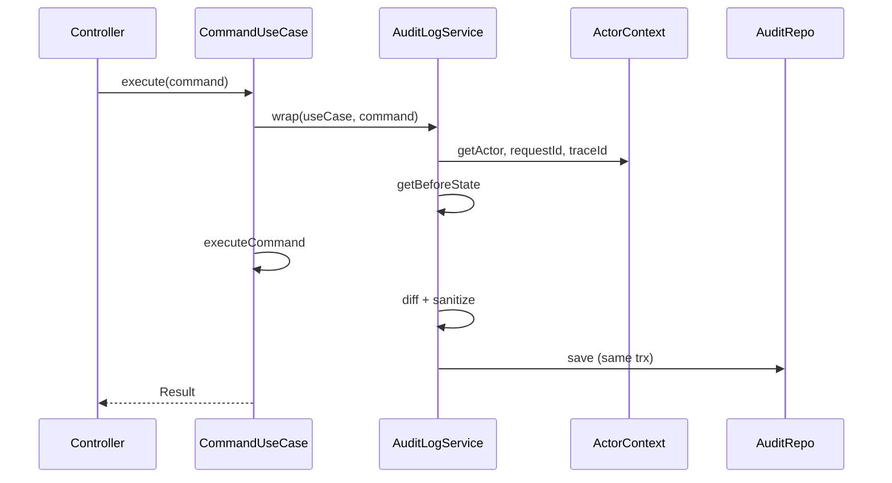

# Audit log

This template provides an `@AuditLog()` class decorator for `CommandUseCase` implementations. It automatically records **who** performed an action, **when** it happened, and **what changed** (previous state, new state, and a field-level diff).

## When to use it

- Apply `@AuditLog()` only on **command use cases** (`CommandUseCase`) that mutate data.
- Do **not** use it on query use cases (`QueryUseCase`) — reads should not produce audit entries.
- Opt in per use case: commands without the decorator behave exactly as before.

## Setup

### 1. Run the migration

The `audit_logs` table is created by:

```bash
pnpm migration:run
```

To regenerate the migration from entities (requires a running PostgreSQL instance):

```bash
pnpm migration:generate src/database/migrations/AuditLog
```

### 2. Module registration

`AuditLogEntity`, `AuditLogService`, and `ActorContextService` are registered globally in `SharedModule`. No extra setup is required in feature modules.

`RequestContextMiddleware` stores `requestId` and client IP in CLS for every HTTP request.

## Basic usage

Decorate the use case class and configure what to capture:

```typescript
import { Injectable } from '@nestjs/common';
import { AuditLog, CommandUseCase } from '../../shared/application';

type UpdateUserCommand = {
  id: string;
  name: string;
  email: string;
};

@Injectable()
@AuditLog({
  action: 'user.update',
  entityType: 'User',
  entityId: (cmd) => cmd.id,
  getBeforeState: async (cmd, { useCase, trx }) => {
    const uc = useCase as UpdateUserUseCase;
    return uc.findByIdForAudit(cmd.id, trx);
  },
})
export class UpdateUserUseCase extends CommandUseCase<
  UpdateUserCommand,
  UserModel
> {
  constructor(
    logger: PinoLogger,
    @Inject(TRANSACTION_MANAGER) transactionManager: ITransactionManager,
    private readonly userRepository: UserRepository,
  ) {
    super(logger, transactionManager);
  }

  async findByIdForAudit(id: string, trx?: QueryRunner) {
    return this.userRepository.findById(id, trx);
  }

  protected async executeCommand(command: UpdateUserCommand, trx?: QueryRunner) {
    const user = await this.userRepository.findById(command.id, trx);
    user.update(command.name, command.email);
    return this.userRepository.save(user, trx);
  }
}
```

The controller stays unchanged — call `executeUseCase` as usual:

```typescript
return this.executeUseCase(this.updateUserUseCase, { id, name, email });
```

## Examples by operation

### Create

For creates, omit `getBeforeState`. The after state defaults to the command result:

```typescript
@AuditLog({
  action: 'user.create',
  entityType: 'User',
  getAfterState: async (_cmd, result) => result,
})
export class CreateUserUseCase extends CommandUseCase<
  CreateUserCommand,
  UserModel
> {
  // ...
}
```

The generated entity ID is available in `afterState.id` after the command completes. Use that field when querying audit history for newly created resources.

### Update

Provide `getBeforeState` to load the entity before mutation:

```typescript
@AuditLog({
  action: 'user.update',
  entityType: 'User',
  entityId: (cmd) => cmd.id,
  getBeforeState: async (cmd, { useCase, trx }) =>
    (useCase as UpdateUserUseCase).findByIdForAudit(cmd.id, trx),
})
```

### Delete

Capture the entity before deletion; after state will be `null`:

```typescript
@AuditLog({
  action: 'user.delete',
  entityType: 'User',
  entityId: (cmd) => cmd.id,
  getBeforeState: async (cmd, { useCase, trx }) =>
    (useCase as DeleteUserUseCase).findByIdForAudit(cmd.id, trx),
  getAfterState: async () => null,
})
```

## Decorator options

| Option | Required | Description |
|--------|----------|-------------|
| `action` | Yes | Operation identifier (e.g. `user.update`) |
| `entityType` | Yes | Affected resource type (e.g. `User`) |
| `entityId` | No | Extracts entity ID from the command |
| `getBeforeState` | No | Loads state before the command runs |
| `getAfterState` | No | Loads state after success; defaults to command result |
| `skipOnFailure` | No | Reserved for future use; failures never persist today |

### Capture context

Callbacks receive a context object:

```typescript
type AuditCaptureContext = {
  useCase: object;
  trx?: QueryRunner;
  actor: ActorSnapshot;
  requestId?: string;
  traceId?: string;
  ipAddress?: string;
};
```

Use `trx` when loading before/after state so reads participate in the same transaction as the command.

## Actor context (who)

Unauthenticated requests are recorded with:

```typescript
{ actorId: null, actorType: 'anonymous' }
```

The global `JwtAuthGuard` sets the actor after validating the JWT and loading roles from the database:

```typescript
this.actorContext.setActor({
  actorId: user.id,
  actorType: 'user',
  displayName: user.email,
});
```

Public routes (`@Public()`, `/healthy`, `/metrics`) skip authentication and keep the anonymous actor.

Reference implementation in `src/modules/auth/infrastructure/guards/jwt-auth.guard.ts`. When extending auth, set the actor from a guard:

```typescript
@Injectable()
export class JwtAuthGuard implements CanActivate {
  constructor(private readonly actorContext: ActorContextService) {}

  canActivate(context: ExecutionContext): boolean {
    const request = context.switchToHttp().getRequest();
    const user = request.user;

    this.actorContext.setActor({
      actorId: user.id,
      actorType: 'user',
      displayName: user.email,
    });

    return true;
  }
}
```

For system/background jobs without HTTP context:

```typescript
this.actorContext.setActor({
  actorId: 'scheduler',
  actorType: 'system',
});
```

## Transactions

When a command runs inside `TypeOrmTransactionManager`, the audit row is written with the **same** `QueryRunner`. If the command rolls back, the audit entry rolls back too.

Commands with `requiresTransaction(): false` still produce audit entries, but outside a DB transaction.

## Sensitive fields

Passwords, tokens, secrets, and API keys are redacted automatically in `beforeState`, `afterState`, and `changes` (same list as use case logging).

## Stored record shape

Each row in `audit_logs` contains:

| Column | Description |
|--------|-------------|
| `actorId` / `actorType` | Who performed the action |
| `action` | Operation name |
| `entityType` / `entityId` | What was affected |
| `beforeState` / `afterState` | JSON snapshots |
| `changes` | `{ "field": { "from": ..., "to": ... } }` diff |
| `requestId` / `traceId` | Correlation with logs and APM |
| `ipAddress` | Client IP when available |
| `useCaseName` | Command use case class name |
| `createdAt` | When the action occurred |

## Querying audit logs

```typescript
const logs = await dataSource
  .getRepository(AuditLogEntity)
  .find({
    where: { entityType: 'User', entityId: userId },
    order: { createdAt: 'DESC' },
  });
```

Or with SQL:

```sql
SELECT "action", "actorId", "changes", "createdAt"
FROM audit_logs
WHERE "entityType" = 'User' AND "entityId" = $1
ORDER BY "createdAt" DESC;
```

## Architecture

1. `@AuditLog()` stores metadata on the use case class via `SetMetadata`.
2. `CommandUseCase.executeImpl()` delegates to `AuditLogService.wrap()` when metadata is present.
3. `AuditLogService` captures before state, runs the command, computes diff, and persists via `IAuditLogRepository`.
4. `ActorContextService` and `TraceContextService` supply request-scoped metadata from CLS.



## Related docs

- [Distributed tracing](tracing.md) — correlate audit rows with `traceId`
- [HTTP resilience](http-resilience.md) — outbound calls from command use cases
