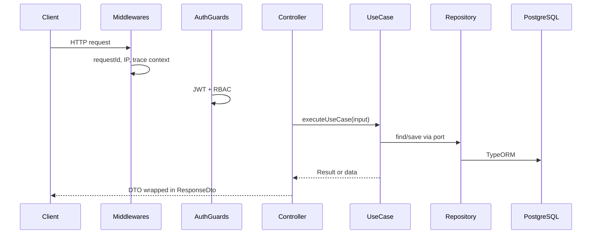

# Architecture

The template follows **hexagonal (ports and adapters) architecture** with a clear separation between domain logic, application orchestration, and infrastructure concerns.

## What it is

Each feature lives in `src/modules/{feature}/` with three layers:

```
src/modules/users/
├── domain/           # Business rules, models, events, errors (no framework imports)
├── application/      # Use cases, ports (interfaces), orchestration
└── infrastructure/ # Controllers, TypeORM, mappers, guards, external adapters
```

Shared cross-cutting code lives in `src/modules/shared/`.

## Layer responsibilities

| Layer | Contains | Must not depend on |
|-------|----------|-------------------|
| **Domain** | Models, value objects, domain events, domain errors | NestJS, TypeORM, HTTP |
| **Application** | Use cases, port interfaces, mappers contract | Concrete DB/HTTP implementations |
| **Infrastructure** | Controllers, repositories, gateways, guards | — (implements ports) |

## Use case pattern

All business logic flows through use cases:

| Type | Base class | Use for |
|------|------------|---------|
| Commands (writes) | `CommandUseCase` | Create, update, delete — may use transactions, audit, domain events |
| Queries (reads) | `QueryUseCase` | Read-only operations — no side effects |

Key files:

- `src/modules/shared/application/use-cases/command.use-case.ts`
- `src/modules/shared/application/use-cases/query.use-case.ts`
- `src/modules/shared/application/use-cases/base.use-case.ts`

### Result pattern

Commands return `Result<T>` instead of throwing for expected failures:

```typescript
// Success
return Result.ok(user);

// Expected failure (maps to HTTP via BaseController)
return Result.fail(new NotFoundError('User not found'));
```

`BaseController.executeUseCase()` unwraps `Result`, logs domain failures, and throws the appropriate HTTP exception.

## Ports and adapters

Application code depends on **ports** (interfaces + injection tokens), not concrete implementations:

```typescript
// Port (application layer)
export const USER_REPOSITORY = Symbol('USER_REPOSITORY');
export interface IUserRepository extends IRepository<UserModel> {
  findByEmail(email: string): Promise<UserModel | null>;
}

// Adapter (infrastructure layer)
@Injectable()
export class TypeOrmUserRepository extends TypeOrmBaseRepository<UserModel, UserEntity> {
  // ...
}

// Module binding
{ provide: USER_REPOSITORY, useExisting: TypeOrmUserRepository }
```

Common ports in `src/modules/shared/application/ports/`:

| Port | Token | Purpose |
|------|-------|---------|
| `ITransactionManager` | `TRANSACTION_MANAGER` | Wrap commands in DB transactions |
| `IHttpClient` | `HTTP_CLIENT` | Resilient outbound HTTP |
| `IEmailSender` | `EMAIL_SENDER` | Send transactional emails |
| `IStorageService` | `STORAGE_SERVICE` | File upload/storage |

## Transactions

`CommandUseCase` can run inside a TypeORM transaction via `ITransactionManager`. When enabled, audit entries, outbox rows, and aggregate writes commit or roll back together.

## Module boundaries

- Feature modules **export ports** other modules need (e.g. `UsersModule` exports `USER_REPOSITORY`).
- Cross-module reactions use **domain events** (`@OnEvent` handlers), not direct repository calls from unrelated modules.
- `SharedModule` is `@Global()` and provides audit, outbox, metrics, HTTP client, and event infrastructure.

## Request flow



## Configuration

Application behavior is driven by environment variables validated at startup. See [`example.env`](../../example.env) and [security.md](./security.md).

## Related guides

- [New feature module](../guides/new-feature-module.md) — Scaffold a module end to end
- [Use cases](../guides/use-cases.md) — Implement commands and queries
- [Repositories and mappers](../guides/repositories-and-mappers.md) — Persistence adapters

## Reference implementation

- `src/modules/users/` — Full CRUD with audit, events, RBAC
- `src/modules/auth/` — Cross-module port usage, guards, extended auth flows
- `src/modules/shared/` — Shared abstractions and infrastructure
