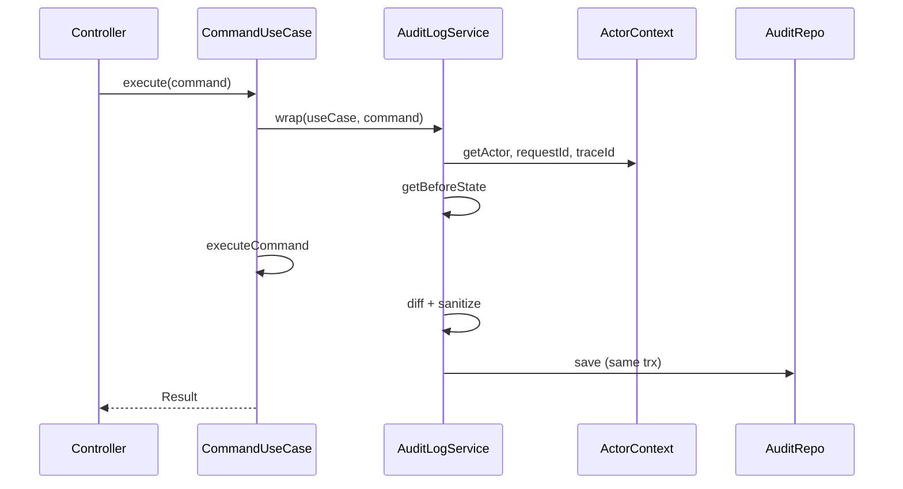

# Audit log

Command use cases that mutate data can opt in to automatic audit logging with the `@AuditLog()` decorator. Each entry records **who** performed an action, **when** it happened, and **what changed** (before state, after state, and a field-level diff).

## What it is

Audit entries are persisted in the `audit_logs` table with actor context, correlation IDs, and sanitized state snapshots. Writes participate in the same DB transaction as the command when a transaction is active.

For step-by-step decorator usage, see [guides/audit-logging.md](../../guides/audit-logging.md).

## When to use it

- Apply `@AuditLog()` only on **command use cases** (`CommandUseCase`) that mutate data.
- Do **not** use on query use cases — reads should not produce audit entries.
- Opt in per use case: commands without the decorator behave as before.

## Setup

```bash
pnpm migration:run
```

`AuditLogEntity`, `AuditLogService`, and `ActorContextService` are registered globally in `SharedModule`. `RequestContextMiddleware` stores `requestId` and client IP in CLS for every HTTP request.

## Architecture



1. `@AuditLog()` stores metadata on the use case class via `SetMetadata`.
2. `CommandUseCase.executeImpl()` delegates to `AuditLogService.wrap()` when metadata is present.
3. `AuditLogService` captures before state, runs the command, computes diff, and persists.
4. `ActorContextService` and `TraceContextService` supply request-scoped metadata from CLS.

## Actor context

| Request type | Actor |
|--------------|-------|
| Unauthenticated | `{ actorId: null, actorType: 'anonymous' }` |
| JWT authenticated | `{ actorId: userId, actorType: 'user', displayName: email }` |
| Background job | `{ actorId: 'scheduler', actorType: 'system' }` |

Set in `JwtAuthGuard` after token validation. Public routes keep the anonymous actor.

## Stored record shape

| Column | Description |
|--------|-------------|
| `actorId` / `actorType` | Who performed the action |
| `action` | Operation name (e.g. `user.update`) |
| `entityType` / `entityId` | What was affected |
| `beforeState` / `afterState` | JSON snapshots (sensitive fields redacted) |
| `changes` | `{ "field": { "from": ..., "to": ... } }` diff |
| `requestId` / `traceId` | Correlation with logs and APM |
| `ipAddress` | Client IP when available |
| `useCaseName` | Command use case class name |
| `createdAt` | When the action occurred |

## Transactions

When a command runs inside `TypeOrmTransactionManager`, the audit row uses the **same** `QueryRunner`. If the command rolls back, the audit entry rolls back too.

## Sensitive fields

Passwords, tokens, secrets, and API keys are redacted in `beforeState`, `afterState`, and `changes`.

## Querying audit logs

```sql
SELECT "action", "actorId", "changes", "createdAt"
FROM audit_logs
WHERE "entityType" = 'User' AND "entityId" = $1
ORDER BY "createdAt" DESC;
```

## Metrics

Audit writes are counted in Prometheus (`audit_log_writes_total`, `audit_log_write_errors_total`). See [observability/metrics-and-logging.md](../observability/metrics-and-logging.md).

## Related guides

- [Audit logging (how-to)](../../guides/audit-logging.md) — `@AuditLog` decorator options and examples
- [Distributed tracing](../observability/distributed-tracing.md) — Correlate with `traceId`

## Reference implementation

- `src/modules/users/application/use-cases/update-user.use-case.ts`
- `src/modules/shared/application/audit/`
