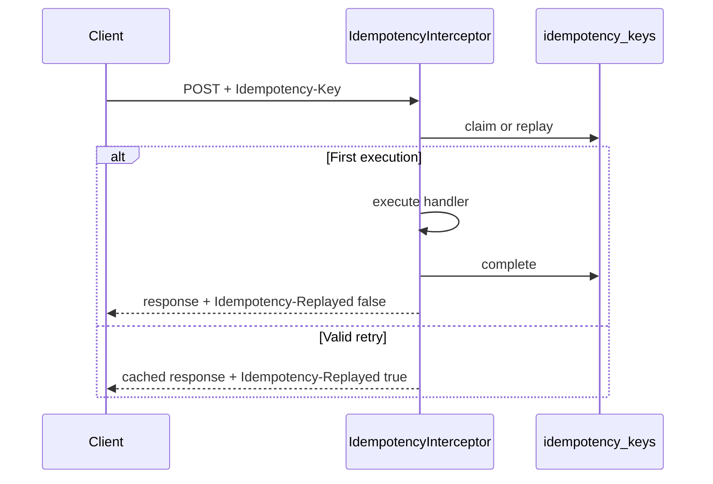

# Inbound idempotency

Clients can send `Idempotency-Key` on `POST`/`PUT`/`PATCH` to receive the same response on retries. This covers **inbound** idempotency (clients → your API). For outbound HTTP retries, see [http-resilience.md](./http-resilience.md).

## What it is

The `idempotency_keys` table caches responses with a configurable TTL. Safe retries are opt-in: without the header, requests behave as before.

## When to use it

Send `Idempotency-Key` when the client may retry the same operation due to:

- Network timeouts or transient errors
- Double-tap on mobile apps
- Automatic gateway/SDK resubmission
- Sensitive operations (registration, payments, resource creation)

## Client contract

### Header

| Header | Required | Description |
|--------|----------|-------------|
| `Idempotency-Key` | Yes (to activate) | Unique key per logical operation. UUID v4 recommended. |

### Supported methods

- `POST`, `PUT`, `PATCH`

`GET`, `HEAD`, `OPTIONS`, and `DELETE` are not processed by this mechanism.

### Scope

Uniqueness is per `(scope, idempotency_key)`:

| Context | Scope |
|---------|-------|
| Authenticated user | `user:{userId}` |
| Public endpoint | `anonymous` |

Two different users can reuse the same key without conflict.

### Example

```http
POST /api/v1/auth/register HTTP/1.1
Idempotency-Key: 7f5c8f2a-0c4b-4f6a-9c2d-8b1e4a6f9d0c
Content-Type: application/json

{ "email": "user@example.com", "password": "secret" }
```

## Responses

| Header | Values | Meaning |
|--------|--------|---------|
| `Idempotency-Replayed` | `true` / `false` | `true` if response comes from cache |

| Status | When |
|--------|------|
| Cached `2xx` / `4xx` | Retry with same key and same body |
| `409 Conflict` | Another request with same key is in progress (`Retry-After: 1`) |
| `422 Unprocessable Entity` | Same key but different body |

`4xx` errors (including validation) are cached. `5xx` are **not** cached — the `in_progress` row is removed to allow retry.

## How it works



Implementation: `src/modules/shared/infrastructure/idempotency/idempotency.interceptor.ts`.

## Configuration

| Variable | Default | Description |
|----------|---------|-------------|
| `IDEMPOTENCY_ENABLED` | `true` | Enable/disable interceptor |
| `IDEMPOTENCY_TTL_HOURS` | `24` | Key lifetime |
| `IDEMPOTENCY_CLEANUP_CRON` | `0 */6 * * *` | Cron to purge expired keys |

Run migration:

```bash
pnpm migration:run
```

## Opt-out per endpoint

```typescript
import { SkipIdempotency } from '../shared/infrastructure/idempotency';

@SkipIdempotency()
@Post('internal/webhook')
handleWebhook() { /* ... */ }
```

Globally excluded: `/health`, `/health/live`, `/health/ready`, `/metrics`.

## Relationship with outbox messaging

| Layer | Guarantee | Mechanism |
|-------|-----------|-----------|
| Inbound API | Exactly-once per key (TTL window) | `Idempotency-Key` + `idempotency_keys` |
| Outbound messaging | At-least-once | Outbox relay |

Message consumers must be idempotent. See [domain-events-and-outbox.md](./domain-events-and-outbox.md).

## Related guides

- [Controllers](../../guides/controllers.md) — No controller changes required; interceptor is global
