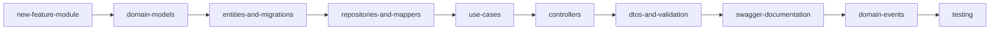

# Developer guides

This section explains **how** to build with the template: step-by-step playbooks for adding modules, endpoints, persistence, and cross-cutting patterns. For what each capability does and how to configure it, see [features](../features/README.md).

## Learning path (new contributor)

Follow this order when learning the codebase end to end:

1. [new-feature-module.md](./new-feature-module.md) — Scaffold a feature from scratch
2. [domain-models.md](./domain-models.md) — `BaseModel`, value objects, `AggregateRoot`
3. [entities-and-migrations.md](./entities-and-migrations.md) — TypeORM entities and migrations
4. [repositories-and-mappers.md](./repositories-and-mappers.md) — `IMapper`, ports, `TypeOrmBaseRepository`
5. [use-cases.md](./use-cases.md) — `CommandUseCase`, `QueryUseCase`, transactions
6. [controllers.md](./controllers.md) — `BaseController`, guards, `executeUseCase`
7. [dtos-and-validation.md](./dtos-and-validation.md) — Request/response DTOs, validation
8. [swagger-documentation.md](./swagger-documentation.md) — OpenAPI decorators and contract tests
9. [domain-events.md](./domain-events.md) — Define events and `@OnEvent` handlers
10. [testing.md](./testing.md) — Unit, integration, e2e, contract tests

## Quick path (add an endpoint)

| Step | Guide |
|------|-------|
| 1. Add or extend a use case | [use-cases.md](./use-cases.md) |
| 2. Add request/response DTOs | [dtos-and-validation.md](./dtos-and-validation.md) |
| 3. Wire the controller route | [controllers.md](./controllers.md) |
| 4. Document in Swagger | [swagger-documentation.md](./swagger-documentation.md) |
| 5. Protect with RBAC (if needed) | [rbac-on-endpoints.md](./rbac-on-endpoints.md) |

## Cross-cutting playbooks

| Guide | When to use |
|-------|-------------|
| [domain-errors.md](./domain-errors.md) | Add typed business errors with stable codes |
| [audit-logging.md](./audit-logging.md) | Record who changed what on command use cases |
| [domain-events.md](./domain-events.md) | Emit events and react with handlers |
| [rbac-on-endpoints.md](./rbac-on-endpoints.md) | Add permissions and guard routes |
| [testing.md](./testing.md) | Write unit, integration, or e2e tests |

## Reference implementation

The **`users`** module is the canonical end-to-end example. See [reference-users-module.md](./reference-users-module.md) for how auth, audit, events, optimistic locking, and idempotency come together.

Source: `src/modules/users/`

## Related

- [Features index](../features/README.md) — What each capability does
- [README](../../README.md) — Install and run the project
